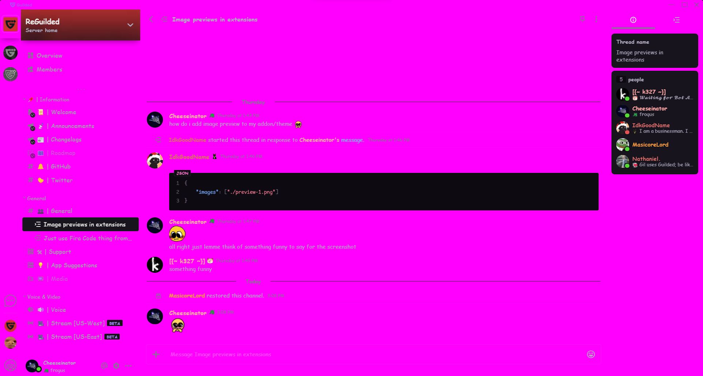

    

<h1 align="center">
    <i>magenta</i> - an awful theme for <a href="https://github.com/ReGuilded/ReGuilded">ReGuilded</a>
</h1>

## FAQ

### What does this do?

This theme changes the background color of [Guilded](https://guilded.gg) to a bright, painful magenta. It also sets the font to Comic Sans on systems that support it.

Currently, only chat channels are supported.

### Why should I use this?

You shouldn't.

## Troubleshooting 

### Why do my codeblocks have a different font than in the screenshot?

You likely don't have [Comic Mono](https://dtinth.github.io/comic-mono-font/) installed.

### Why do my codeblocks have a different colorscheme than in the screenshot?

That's an actual bug. I have no idea what causes that.
